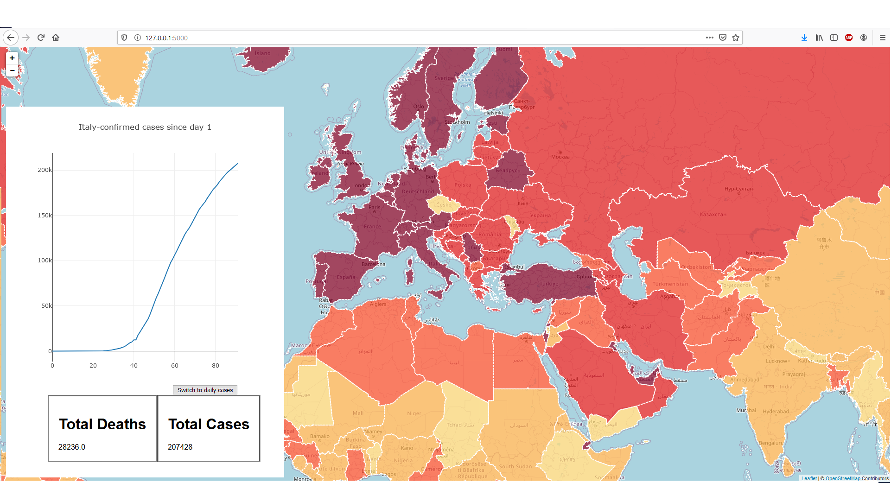
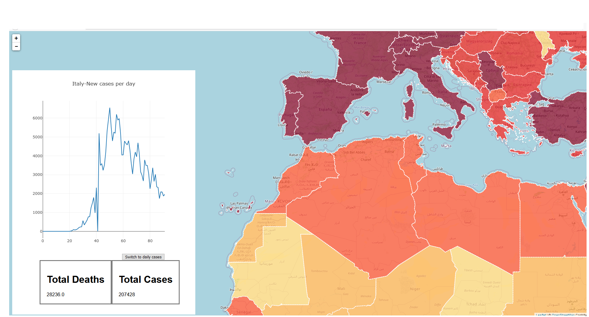

# covid19HeatMap
A covid 19 heatmap with graphs.
A leaflet map  with plotly graphs and flask being the backend.

The data is fetched from https://github.com/CSSEGISandData/COVID-19/tree/master/csse_covid_19_data/csse_covid_19_daily_reports and saved in a sql db. The data can be updated with a post request with the admin credentials.

